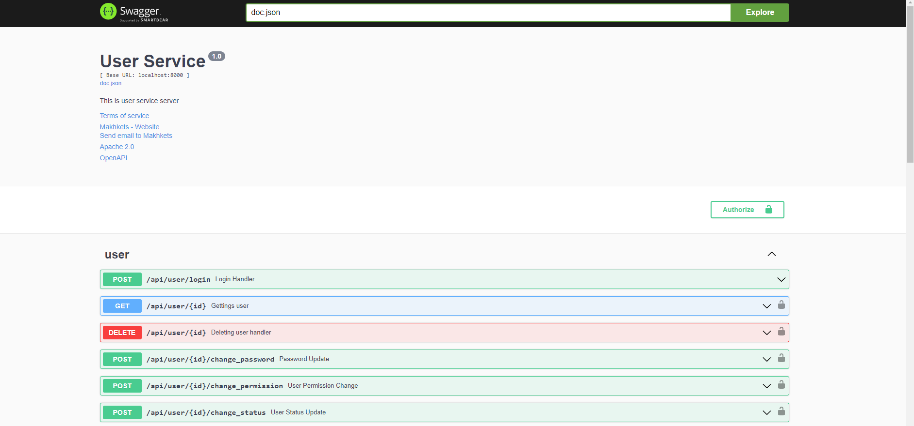
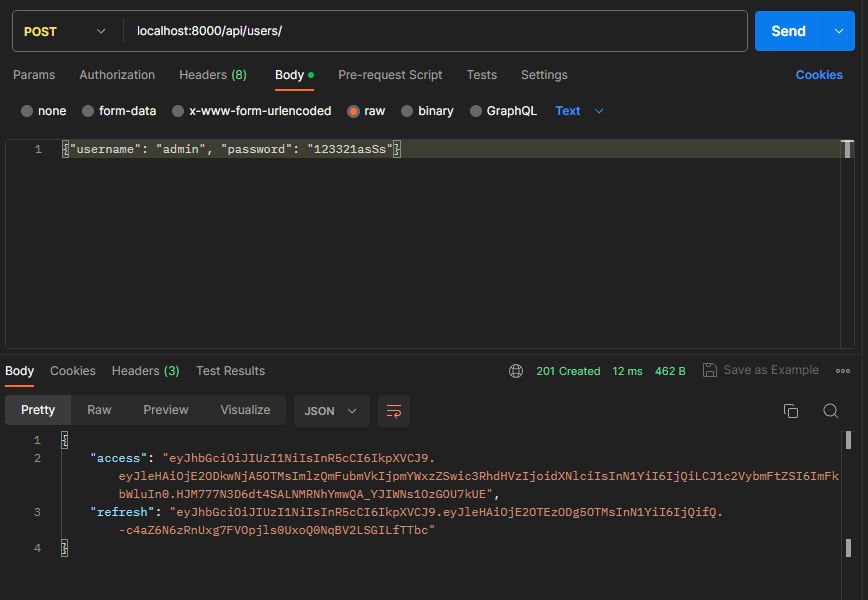
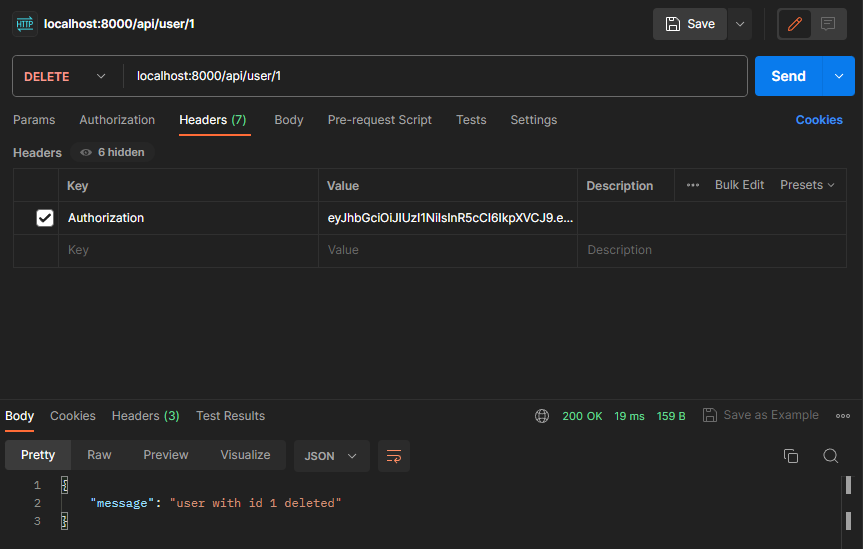
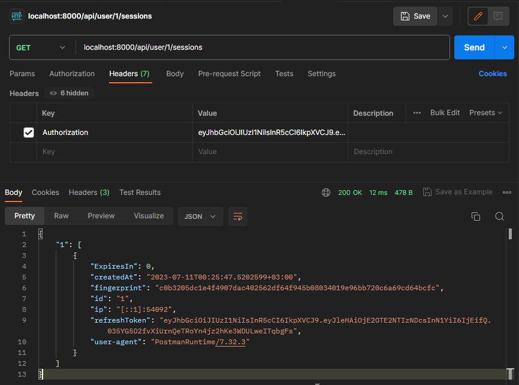
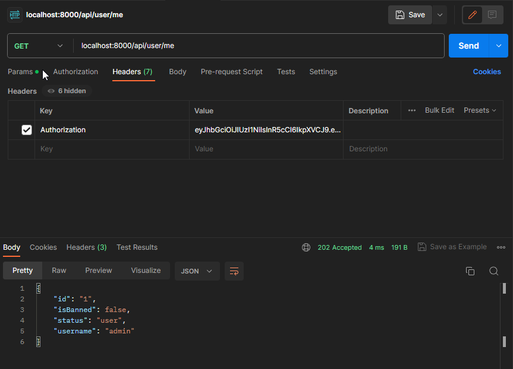

## User Service based on -> Golang (Gin framework) \ Postgresql (goose migrator) \ Redis \ Docker \ Swagger \ Makefile \ Unit Tests

- [X]  ⚡ Высокопроизводительный фреймворк - Gin
- [X]  ⚡ Высокопроизводительный логгер - Uber Zap Logger
- [X]  🔥 Документация Swagger 

#### 

- [X]  Аутентификая с помощью JWT
- [X]  Роли юзеров (user, moderator, admin)
- [X]  Middleware для каждой роли
- [X]  Шифрование паролей, с использованием secret key
- [X]  Сохранение всех сессий аккаунта юзера, с дальнейшим получением информаций всех сессий (user-agent, ip, refresh tokens, fingerprint, datetime)
- [X]  Бесконечная сессия, до тех пор, пока человек не будет в афк месяц
- [X]  Использование Postgres (goose) \ Redis \ Docker \ Makefile
- [X]  Высокая защита аккаунта от кражи access / refresh токенов (при авторизации сверяется fingerprint устрйоства у которого украли токены)
- [X]  Сохранение логов

## URLS:

- GET    /api/users
- GET    /api/user/:id
- DELETE /api/user/:id
- GET    /api/user/:id/sessions
- POST   /api/user/:id/change_username
- POST   /api/user/:id/change_password
- POST   /api/user/:id/change_status
- POST   /api/user/:id/change_permission
- GET    /api/user/test
- GET    /api/user/me
- POST   /api/users
- POST   /api/user/login
- POST   /api/user/refresh

